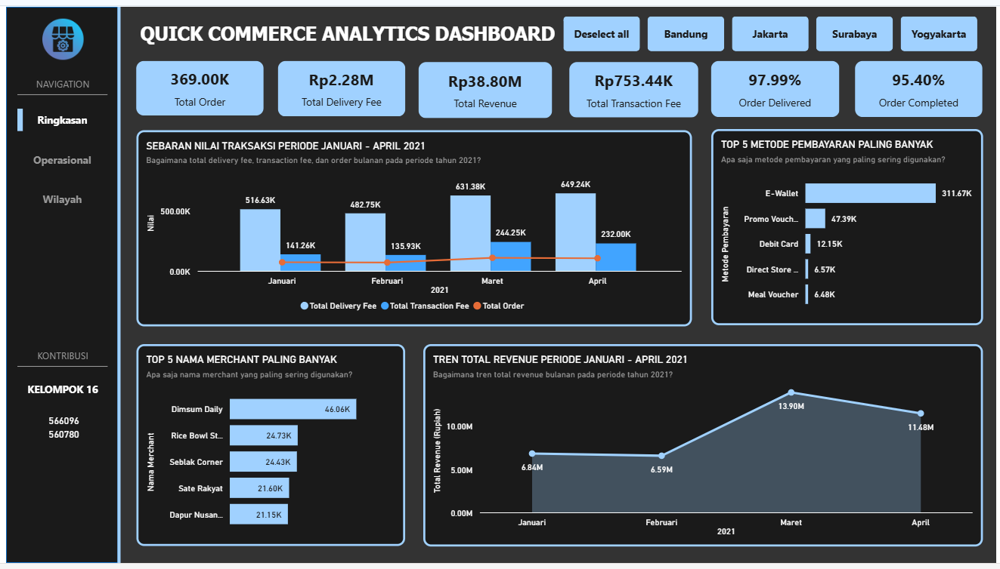
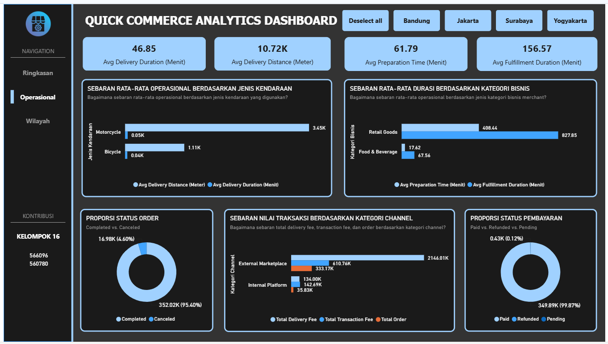
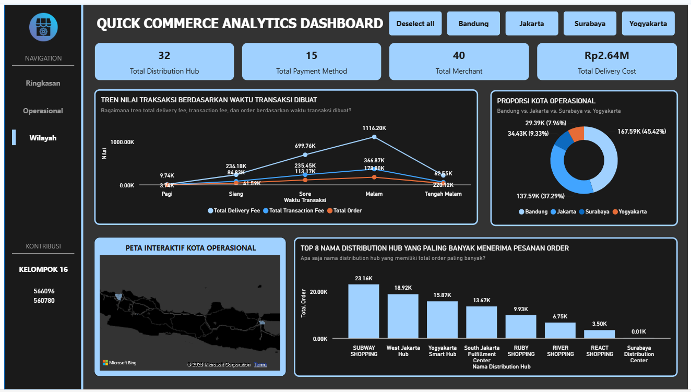

# 📊 Quick Commerce Analytics Dashboard — Responsi EVD Tahap 1

> Repositori dari tugas responsi tahap 1 Praktikum Eksplorasi dan Visualisasi Data tentang *dashboard* laporan penjualan secara interaktif menggunakan *platform* Power BI yang dapat diakses melalui tautan berikut:

> Klik untuk melihat *dashboard*: [Quick Commerce Analytics Dashboard](https://app.powerbi.com/view?r=eyJrIjoiNGZkMjRiMGItNTQ1ZS00NWM0LThhODEtOTkzMjdjY2JlNGY2IiwidCI6ImFmMmMwNzM0LWNiNDItNDY0Zi1iNmJmLTJhMjQxYjZhZGE1NiIsImMiOjEwfQ%3D%3D)

---

## 📋 Project Overview

| Attribute     | Details                              |
|---------------|--------------------------------------|
| **Author**    | Cheisa Billy Putra Antoni            |
|               | Talenta Julyanti Naibaho             |
| **Date**      | July 3, 2026                         |
| **Course**    | Data Exploration and Visualization   |
| **Platform**  | Power BI (2.155.756.0)               |

---

## 📁 Project Structure

```
quick-commerce-analytics-dashboard/
│
├── image/
│   ├── operasional.png
│   ├── ringkasan.png
│   └── wilayah.png
│
├── indonesian_commerce_dataset/
│   ├── customer_orders.csv
│   ├── delivery_transactions.csv
│   ├── delivery_partners.csv
│   ├── distribution_hubs.csv
│   ├── merchants.csv
│   ├── payment_transactions.csv
│   └── sales_channels.csv
│
├── dashboard.pbix
├── eda.ipynb
└── README.md
```

---

## ⚙️ Features

| Halaman        | Fitur                | Deskripsi                           |
| :--- | :--- | :--- |
| **Global** | Slicer / Filter Interaktif | Tombol navigasi cepat untuk memfilter seluruh data dashboard berdasarkan kota operasional (Bandung, Jakarta, Surabaya, Yogyakarta), lengkap dengan fitur *Deselect all*. |
| **Ringkasan** | KPI Cards | Menampilkan metrik utama bisnis: *Total Order*, *Total Delivery Fee*, *Total Revenue*, *Total Transaction Fee*, serta persentase *Order Delivered* dan *Order Completed*. |
| | Combo Chart (Bar + Line) | Sebaran Nilai Transaksi (Januari - April 2021): Menganalisis perbandingan bulanan antara total biaya pengiriman, biaya transaksi, dan volume total order. |
| | Horizontal Bar Chart | Top 5 Metode Pembayaran: Mengidentifikasi metode pembayaran yang paling populer (E-Wallet, Promo Voucher, Debit Card, dll). |
| | Horizontal Bar Chart | Top 5 Nama Merchant: Menampilkan merchant dengan kontribusi volume transaksi tertinggi (seperti Dimsum Daily, Rice Bowl, dll). |
| | Area / Line Chart | Tren Total Revenue: Melihat grafik fluktuasi pertumbuhan pendapatan bisnis dari bulan ke bulan selama periode Q1 2021. |
| **Operasional** | KPI Cards | Menampilkan rata-rata efisiensi logistik: *Avg Delivery Duration*, *Avg Delivery Distance*, *Avg Preparation Time*, dan *Avg Fulfillment Duration*. |
| | Grouped Bar Chart | Sebaran Rata-rata Operasional vs Jenis Kendaraan: Membandingkan efisiensi jarak dan waktu pengiriman antara armada Motor (*Motorcycle*) dan Sepeda (*Bicycle*). |
| | Grouped Bar Chart | Sebaran Rata-rata Durasi vs Kategori Bisnis: Menganalisis perbandingan waktu penyiapan dan pemenuhan order antara kategori *Retail Goods* dan *Food & Beverage*. |
| | Donut Chart | Proporsi Status Order & Status Pembayaran: Visualisasi persentase rasio order sukses vs gagal (*Completed* vs *Canceled*) serta status kelancaran transaksi (*Paid*, *Refunded*, *Pending*). |
| | Horizontal Bar Chart | Sebaran Nilai Transaksi via Kategori Channel: Membandingkan performa penjualan yang datang dari *External Marketplace* vs *Internal Platform*. |
| **Wilayah** | KPI Cards | Menampilkan kapasitas operasional fisik: *Total Distribution Hub*, *Total Payment Method*, *Total Merchant*, dan *Total Delivery Cost*. |
| | Line Chart | Tren Nilai Transaksi Berdasarkan Waktu: Menganalisis pola perilaku transaksi pengguna berdasarkan waktu pemesanan (Pagi, Siang, Sore, Malam, Tengah Malam). |
| | Donut Chart | Proporsi Kota Operasional: Melihat sebaran pangsa pasar dan kontribusi transaksi terbesar antar kota (didominasi oleh Bandung dan Jakarta). |
| | Map Visual | Peta Interaktif Kota Operasional: Visualisasi geografis langsung untuk pemetaan titik persebaran logistik di Pulau Jawa. |
| | Vertical Bar Chart | Top 8 Nama Distribution Hub: Mengurutkan pusat distribusi (hub) yang menangani volume pesanan paling padat (dipimpin oleh *Subway Shopping*). |

---

## 🚀 Dashboard View

### 1. Halaman Ringkasan


### 2. Halaman Operasional


### 3. Halaman Wilayah


---

## 👤 Author

**Cheisa Billy Putra Antoni**<br>**Talenta Julyanti Naibaho**
📅 July 3, 2026